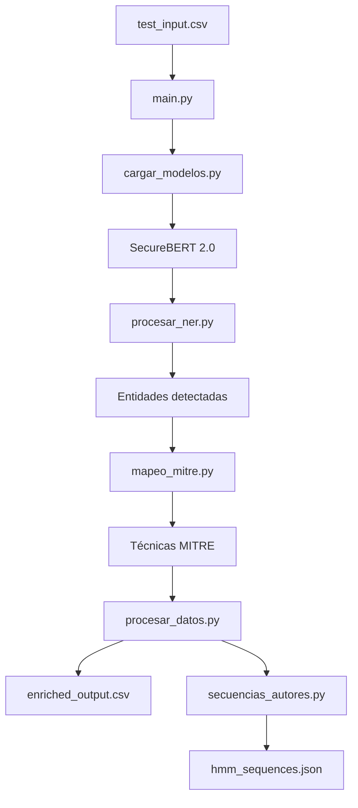

# Fase 2: Procesamiento de Lenguaje Natural con Modelos Especializados

**Núcleo Semántico del Proyecto** - Transformación de texto de Dark Web en datos estructurados para HMM

---

## 📋 Descripción General

Esta fase implementa el **procesamiento NLP avanzado** utilizando modelos **SecureBERT 2.0** para analizar conversaciones de foros `.onion`, extraer entidades de ciberseguridad y preparar datos estructurados que alimentarán el modelo **Hidden Markov Model (HMM)** en la Fase 3.

### 🎯 Objetivos Principales

1. **Detección de Entidades Especializadas**: Identificar herramientas ofensivas, vulnerabilidades, técnicas MITRE y sectores objetivo
2. **Enriquecimiento Semántico**: Añadir metadatos estructurados a los datos crudos
3. **Mapeo a MITRE ATT&CK**: Asociar entidades detectadas con técnicas de ataque conocidas
4. **Preparación para HMM**: Crear secuencias cronológicas de posts por autor
5. **Generación de Datos Estructurados**: Produce salidas listas para modelado predictivo

---

## 🏗️ Arquitectura del Sistema (Modular)

La Fase 2 está organizada en **módulos independientes** con nombres en español para facilitar su comprensión y presentación.

```
Fase 2/
├── modulos/                    # Código fuente modular
│   ├── main.py                # Orquestador principal del pipeline
│   ├── cargar_modelos.py      # Carga de modelos SecureBERT 2.0
│   ├── procesar_ner.py        # Detección de entidades (NER)
│   ├── mapeo_mitre.py         # Mapeo a técnicas MITRE ATT&CK
│   ├── secuencias_autores.py  # Agrupación y filtrado para HMM
│   ├── procesar_datos.py      # Lectura/escritura de archivos
│   └── __init__.py            # Inicializador del paquete
├── mitre_mapping.json         # Diccionario MITRE (100+ entradas)
├── requirements.txt           # Dependencias completas
├── README.md                  # Esta documentación
└── test_input.csv             # Datos de prueba
```

### Diagrama de Flujo



### Responsabilidad de cada Módulo

| Módulo | Responsabilidad |
|--------|----------------|
| `main.py` | Orquesta todo el pipeline: carga modelos → procesa NER → mapea MITRE → genera secuencias |
| `cargar_modelos.py` | Carga SecureBERT 2.0 desde Hugging Face (con fallback automático) y crea pipelines |
| `procesar_ner.py` | Reconoce entidades de ciberseguridad en el texto usando NER |
| `mapeo_mitre.py` | Asocia entidades detectadas con técnicas MITRE ATT&CK y calcula puntuación de amenaza |
| `secuencias_autores.py` | Agrupa posts por autor, ordena cronológicamente y filtra secuencias válidas (≥3) |
| `procesar_datos.py` | Lee/escribe archivos CSV y genera JSON con formato para HMM |

---

## 🔧 Tecnologías Utilizadas

### Modelos de Lenguaje
- **SecureBERT 2.0-NER**: Modelo especializado en ciberseguridad para detección de entidades
- **Fallback automático**: Si SecureBERT no está disponible, usa `bert-base-uncased`

### Librerías Principales
| Librería | Versión | Propósito |
|----------|---------|-----------|
| `transformers` | 4.41.2 | Carga y uso de modelos SecureBERT |
| `torch` | 2.2.2 | Backend de PyTorch para inferencia |
| `pandas` | 2.2.2 | Manipulación de datos tabulares |
| `scikit-learn` | 1.5.0 | Utilidades de machine learning |
| `tqdm` | 4.66.4 | Barras de progreso para procesamiento por lotes |

---

## 🚀 Ejecución del Pipeline

### Requisitos Previos

```bash
# 1. Ir a la carpeta de la Fase 2
cd "Fase 2"

# 2. Instalar dependencias
pip install -r requirements.txt

# 3. Verificar instalación
python -c "import transformers, torch; print('Dependencias instaladas correctamente')"
```

### Ejecución con datos de prueba

```bash
# Ir a la carpeta de módulos
cd modulos

# Ejecutar el pipeline
python main.py --input ../test_input.csv --output-csv ../enriched_output.csv --output-hmm ../hmm_sequences.json
```

### Ejecución con datos reales (desde Fase 1)

```bash
cd modulos
python main.py \
    --input "../../Fase 1/Scraping-Onion-Sites/output/forum_record_limpio.csv" \
    --output-csv "../enriched_forum_data.csv" \
    --output-hmm "../author_sequences.json"
```

### Parámetros Configurables

| Parámetro | Abreviatura | Descripción | Valor por Defecto |
|-----------|-------------|-------------|-------------------|
| `--input` | `-i` | Ruta al CSV de entrada (limpio de Fase 1) | `test_input.csv` |
| `--output-csv` | `-o` | Ruta al CSV de salida enriquecido | `enriched_forum_data.csv` |
| `--output-hmm` | `-m` | Ruta al JSON de salida para HMM | `author_sequences.json` |
| `--mitre-mapping` | `-d` | Ruta al archivo de mapeo MITRE | `mitre_mapping.json` |

---

## 📊 Salidas Generadas

### 1. `enriched_output.csv` (Datos Enriquecidos)

**Columnas originales** (heredadas de Fase 1):
- `message_id`, `username`, `timestamp`, `body_limpio`, `forum_name`

**Columnas nuevas** (agregadas por Fase 2):
| Columna | Descripción |
|---------|-------------|
| `entities` | JSON con entidades detectadas (tipo, texto, confianza) |
| `mitre_techniques` | JSON con IDs de técnicas MITRE |
| `threat_score` | Puntuación de amenaza (0-1) |
| `entity_count` | Número de entidades detectadas |
| `mitre_count` | Número de técnicas MITRE mapeadas |

**Ejemplo de entidad detectada**:
```json
{
  "type": "LABEL_1",
  "text": "cobalt strike",
  "confidence": 0.5662,
  "start": 0,
  "end": 13
}
```

### 2. `hmm_sequences.json` (Secuencias para HMM)

**Estructura**:
```json
{
  "metadata": {
    "total_autores": 2,
    "secuencias_validas": 1,
    "generado_en": "2026-05-29T20:33:46.451480",
    "longitud_minima_secuencia": 3
  },
  "sequences": {
    "user1": [
      {
        "message_id": "msg_001",
        "timestamp": "2026-05-22T02:08:27.214395+00:00",
        "threat_score": 0.4261,
        "entities": [
          {"type": "LABEL_0", "text": "cobalt strike", "confidence": 0.5662}
        ],
        "mitre_techniques": ["T1204.002"]
      }
    ]
  }
}
```

---

## 🎯 Entidades Detectadas

### Categorías de Entidades

1. **Herramienta-ofensiva**: Malware, exploits, kits
   - Ejemplos: `Cobalt Strike`, `Mimikatz`, `Metasploit`, `Emotet`
2. **Vulnerabilidad**: Identificadores CVE
   - Formato: `CVE-YYYY-NNNN` (ej: `CVE-2024-1234`)
3. **Técnica MITRE**: Tácticas y técnicas de ataque
   - Ejemplos: `lateral movement`, `credential dumping`, `phishing`
4. **Sector-objetivo**: Industrias o países mencionados
   - Ejemplos: `bancario`, `salud`, `gobierno`, `EE.UU.`

### Ejemplos de Mapeo MITRE

| Entidad | Técnicas MITRE Mapeadas |
|---------|------------------------|
| CobaltStrike | T1059.001, T1043, T1087.001 |
| Mimikatz | T1003.001, T1003.002 |
| Phishing | T1566 |
| Ransomware | T1486 |
| Lateral Movement | T1021.001, T1021.002 |

---

## 📈 Métricas y Validación

### Cálculo de Puntuación de Amenaza

```python
puntuacion_amenaza = (confianza_promedio_entidades * 0.7) + (cantidad_tecnicas_mitre * 0.3)
```

- **Rango**: 0.0 (sin amenaza) a 1.0 (máxima amenaza)
- **Componentes**:
  - 70%: Confianza media de entidades detectadas
  - 30%: Número de técnicas MITRE identificadas (normalizado a 0-1)

### Validación de Secuencias

1. **Longitud mínima**: ≥3 posts por autor (evita overfitting en HMM)
2. **Ordenamiento**: Cronológico por timestamp (más antiguo primero)
3. **Cobertura**: Solo autores con actividad suficiente

---

## 🔄 Reejecución y Mantenimiento

### Características de Diseño

- **Reejecutable**: El pipeline puede ejecutarse múltiples veces sobre los mismos datos
- **Actualizable**: Si se actualiza el modelo NER o el diccionario MITRE, basta reejecutar
- **Incremental**: No requiere repetir la costosa fase de scraping
- **Modular**: Cada componente puede actualizarse independientemente
- **Logging completo**: Registro detallado en `processing_log.txt`

### Actualización de Modelos

```bash
# Para actualizar a nuevas versiones de SecureBERT
pip install --upgrade transformers torch

# El pipeline cargará automáticamente los modelos actualizados
```

---

## 🎓 Casos de Uso

### 1. Análisis de Amenazas

```python
import pandas as pd

# Cargar datos enriquecidos
df = pd.read_csv('enriched_output.csv')

# Top 10 posts más amenazantes
top_threats = df.sort_values('threat_score', ascending=False).head(10)

# Entidades más frecuentes
entity_counts = df['entity_count'].value_counts()
```

### 2. Preparación para HMM

```python
import json

# Cargar secuencias para HMM
with open('hmm_sequences.json', 'r') as f:
    hmm_data = json.load(f)

# Estadísticas de secuencias
print(f"Autores totales: {hmm_data['metadata']['total_autores']}")
print(f"Secuencias válidas: {hmm_data['metadata']['secuencias_validas']}")
```

---

## 🚨 Consideraciones de Seguridad

- **Datos sensibles**: El script procesa datos de Dark Web - usar en entornos seguros
- **Modelos grandes**: SecureBERT requiere ~2GB de memoria por modelo
- **Tiempo de ejecución**: Procesamiento por lotes para grandes volúmenes de datos
- **Compatibilidad**: Diseñado para Python 3.9+ con CUDA (recomendado)

---

## 📚 Referencias

- **SecureBERT 2.0**: Modelo especializado en ciberseguridad de Cisco AI
- **MITRE ATT&CK**: Framework de técnicas de adversarios
- **Transformers**: Librería Hugging Face para NLP
- **HMM**: Modelos Ocultos de Markov para análisis de secuencias

---

## ✅ Criterios de Éxito

1. ✅ Detección exitosa de entidades de ciberseguridad
2. ✅ Mapeo correcto a técnicas MITRE ATT&CK
3. ✅ Generación de secuencias válidas para HMM (≥3 posts)
4. ✅ Puntuaciones de amenaza calculadas correctamente
5. ✅ Logging completo y manejo de errores robusto
6. ✅ Compatibilidad con salida de Fase 1
7. ✅ Arquitectura modular con nombres en español
8. ✅ Fallback automático si SecureBERT no está disponible

---

## 🎯 Próximos Pasos (Fase 3)

1. **Entrenamiento HMM**: Usar `hmm_sequences.json` para entrenar el modelo
2. **Análisis Predictivo**: Detectar patrones de comportamiento malicioso
3. **Visualización**: Dashboard de amenazas y tendencias
4. **Integración**: Conectar con sistemas de alerta temprana

**¡La Fase 2 está completa y lista para alimentar el modelo HMM! 🚀**